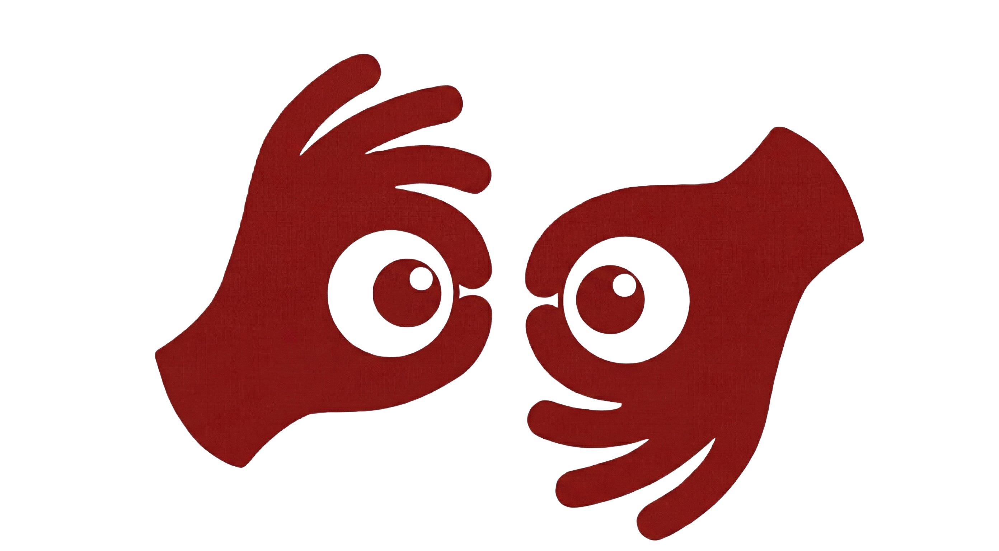
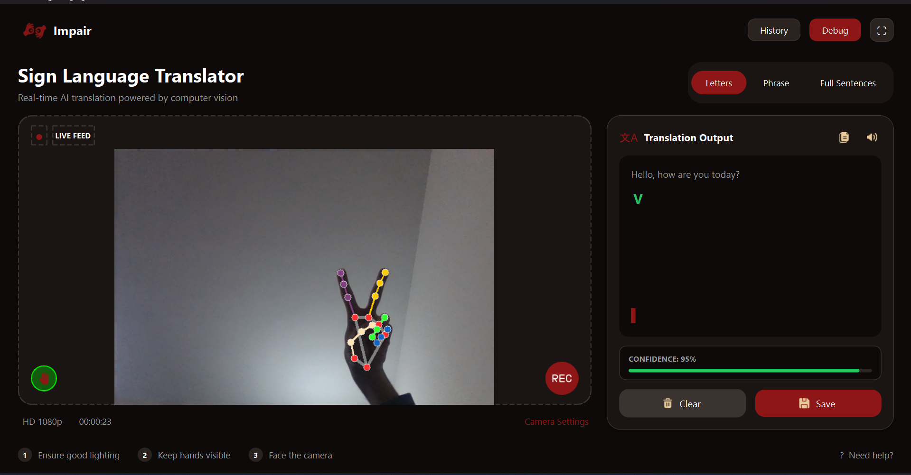

<p align="center">
  
</p>

<h1 align="center">✋ IMPAIR</h1>
<h3 align="center">Real-Time AI-Powered American Sign Language Translator</h3>

<p align="center">
  
  
  
  
</p>

<p align="center">
  <em>Breaking barriers in communication through the power of Computer Vision and Deep Learning</em>
</p>

---

## 📌 Project Title

**IMPAIR - Intelligent Multi-Phase ASL Interpretation & Recognition**

> A comprehensive desktop application that translates American Sign Language (ASL) gestures into text in real-time using computer vision and machine learning techniques.

---

## 👨‍💻 Student Information

| Name | Registration Number |
|:----:|:-------------------:|
| Najaf Ali | 241456 |
| Asma Shoukat | 241418 |
| Amna Tuz Zahra | 241382 |

---

## 🎯 Problem Statement

The motivation behind IMPAIR is to reduce everyday communication barriers faced by the **deaf and hard-of-hearing community**. Many individuals rely on American Sign Language (ASL) as their primary mode of communication, yet most people around them do not understand it.

### The Challenge

- ❌ **Communication Barriers**: Deaf individuals face daily difficulties interacting with non-signers
- ❌ **Limited Vocabulary Tools**: Most existing solutions focus only on static letter recognition
- ❌ **Real-time Performance Issues**: Many systems have latency that disrupts natural conversation
- ❌ **Privacy Concerns**: Traditional video-based systems raise privacy issues

### Our Solution

**IMPAIR** provides a practical tool that converts ASL gestures into text in real time, enabling clearer interaction in daily situations:

- ✅ **Three-tier Recognition System**: Letters, Basic Phrases (5 words), and Extended Vocabulary (80 words)
- ✅ **Real-time Performance**: Prioritized for smooth and natural communication (~30 FPS)
- ✅ **Privacy-Focused**: Processes skeletal landmark data instead of raw video
- ✅ **Expanded Vocabulary**: Beyond basic gestures to support meaningful conversations
- ✅ **User-Friendly Interface**: Modern, intuitive PyQt6 desktop application

---

## 🛠️ Tools & Technologies Used

### Programming Languages & Frameworks

| Category | Technology | Purpose |
|:--------:|:----------:|:-------:|
| **Language** | Python 3.8+ | Core development language |
| **GUI Framework** | PyQt6 | Desktop application interface |
| **ML Framework** | TensorFlow/Keras | Deep learning model development |
| **ML Library** | scikit-learn | Traditional ML (Random Forest) |
| **Computer Vision** | OpenCV | Video capture and processing |
| **Pose Estimation** | MediaPipe | Hand, face, and body landmark detection |

### Key Libraries

```
PyQt6          - Modern cross-platform GUI framework
TensorFlow     - Deep learning and neural networks
OpenCV         - Computer vision and image processing
MediaPipe      - ML-powered pose/hand estimation
NumPy          - Numerical computations
Joblib         - Model serialization
```

### Model Architectures

| Phase | Model Type | Features | Recognition |
|:-----:|:----------:|:--------:|:-----------:|
| **Phase 1** | Random Forest Classifier | 42 hand landmarks (x,y) | 26 ASL Letters |
| **Phase 2** | LSTM Neural Network | 126 features (2 hands × 63) | 5 Common Words |
| **Phase 3** | 1D CNN | 363 features (121 landmarks × 3) | 80 ASL Signs |

### Development Tools

- **Jupyter Notebook** - Model training and experimentation
- **Google Colab** - Cloud-based training environment
- **Kaggle** - Dataset access and model training
- **VS Code** - Primary development IDE

---

## 📁 Project Structure

```
📦 IMPAIR
├── 📂 APP/                          # Main Application
│   ├── 🐍 main.py                   # Entry point
│   ├── 🐍 detection_engine.py       # Core ML inference engine
│   ├── 🐍 translator_screen.py      # Main translator UI
│   ├── 🐍 splash_screen.py          # Loading screen
│   ├── 🐍 styles.py                 # Theme configuration
│   ├── 📄 requirements.txt          # Dependencies
│   └── 📂 assets/                   # UI icons and images
│
├── 📂 ASL_P1_LETTERS/               # Phase 1: Letter Recognition
│   ├── 📓 ASL_Model_Training_P1.ipynb  # Training notebook
│   ├── 🤖 asl_model.joblib          # Trained model
│   └── 🐍 p1_final.py               # Standalone test script
│
├── 📂 ASL_P2_5/                     # Phase 2: 5 Words Recognition
│   ├── 📓 Finalphase2.ipynb         # Training notebook
│   ├── 🤖 my_lstm_model_phase2.h5   # Trained LSTM model
│   └── 🐍 main.py                   # Standalone test script
│
└── 📂 ASL_P3_80/                    # Phase 3: 80 Words Recognition
    ├── 📓 asl-80-training.ipynb     # Training notebook
    ├── 🤖 asl_model.h5              # Trained LSTM model
    ├── 📄 classes.npy               # Class labels
    └── 🐍 main.py                   # Standalone test script
```

---

## 🚀 How to Run the Code

### Prerequisites

Ensure you have Python 3.8 or higher installed on your system.

### Step 1: Clone or Download the Project

```bash
cd path/to/Impair
```

### Step 2: Create a Virtual Environment (Recommended)

```bash
# Create virtual environment
python -m venv venv

# Activate virtual environment
# On Windows:
venv\Scripts\activate

# On macOS/Linux:
source venv/bin/activate
```

### Step 3: Install Dependencies

```bash
pip install PyQt6 opencv-python mediapipe tensorflow numpy joblib scikit-learn
```

### Step 4: Run the Application

```bash
cd APP
python main.py
```

### 🎮 Using the Application

1. **Launch**: The application starts with a splash screen and automatically transitions to the main interface
2. **Select Mode**: Choose from three recognition modes:
   - 🔤 **Letters** - Recognize individual ASL alphabet letters
   - 💬 **Phrase** - Recognize 5 common words (hello, goodbye, thanks, you, me)
   - 📝 **Full Sentences** - Recognize 80 different ASL signs
3. **Start Recording**: Click the record button to begin translation
4. **Position Yourself**: Ensure good lighting and position your hands clearly in frame
5. **View Translation**: See real-time translations with confidence scores

### 🧪 Running Individual Phase Tests

Each phase can be tested independently:

```bash
# Test Phase 1 - Letter Recognition
cd ASL_P1_LETTERS
python p1_final.py

# Test Phase 2 - 5 Words Recognition
cd ASL_P2_5
python main.py

# Test Phase 3 - 80 Words Recognition
cd ASL_P3_80
python main.py
```

---

## 📊 Dataset Sources

### Phase 1: ASL Letter Recognition

| Dataset | Source | Description |
|:-------:|:------:|:-----------:|
| **ASL Hand Keypoints** | [Google Drive](https://drive.google.com/drive/folders/1h_B4DDVMLbWjlwhAt0mL0owfdDbelf9e) | Pre-extracted 2D hand landmark coordinates for 26 ASL letters |

### Phase 2: Word Recognition (5 Words)

| Dataset | Source | Description |
|:-------:|:------:|:-----------:|
| **MediaPipe Hand Landmarks** | [Kaggle Dataset](https://www.kaggle.com/datasets/kafkanguy/mediapipe-hand-landmarks-datasets) | MediaPipe hand landmark sequences for word recognition |
| **Format** | MediaPipe Keypoints | 40 frames × 126 features per sequence |

### Phase 3: Extended Vocabulary (80 Words)

| Dataset | Source | Description |
|:-------:|:------:|:-----------:|
| **ASL 80 Google SLR** | [Kaggle Dataset](https://www.kaggle.com/datasets/najaf456ali/asl-100-google-slr) | Large-scale dataset with 80 ASL sign classes (31,724 video clips) |
| **Features** | 121 Landmarks × 3D | Face (lips, nose, ears), hands, and pose landmarks (64 frames/sequence) |

---

## ✨ Features

<table>
<tr>
<td width="50%">

### 🎨 Modern UI
- Dark theme interface
- Smooth animations
- Live camera preview
- Debug visualization mode

</td>
<td width="50%">

### 🧠 Smart Recognition
- Multi-phase detection
- Real-time confidence scoring
- Frame buffer optimization
- Automatic hand detection

</td>
</tr>
<tr>
<td width="50%">

### 📹 Video Processing
- Live webcam capture
- Mirror view for intuitive signing
- Skeleton overlay (debug mode)
- HD video support (1080p)

</td>
<td width="50%">

### 🔧 Configurable
- Adjustable confidence thresholds
- Mode switching on-the-fly
- Recording timer
- Fullscreen support

</td>
</tr>
</table>

---

## 🎯 Recognition Modes

### 🔤 Letters Mode (Phase 1)
Recognizes all 26 letters of the ASL alphabet using a Random Forest Classifier trained on hand landmark coordinates.

**Supported Signs**: A, B, C, D, E, F, G, H, I, J, K, L, M, N, O, P, Q, R, S, T, U, V, W, X, Y, Z

### 💬 Phrase Mode (Phase 2)
Recognizes 5 commonly used ASL words using an LSTM neural network that processes temporal sequences.

**Supported Signs**: `Hello`, `Goodbye`, `Thanks`, `You`, `Me`

### 📝 Full Sentences Mode (Phase 3)
Extended vocabulary recognition supporting 80 different ASL signs for more complex communication.

**Features**: Uses 1D CNN with holistic body tracking including facial landmarks (lips, nose, ears), body pose, and both hands. Operates at ~30 FPS for real-time performance.

---

## 🖼️ Screenshots

<p align="center">
  
</p>

<p align="center">
  <em>Main Translation Interface</em>
</p>

> *Application features a modern dark theme with live camera feed, mode selection, and real-time translation output with confidence metrics.*

---

## 📈 Model Performance

| Phase | Model | Training Accuracy | Validation Accuracy | Inference Speed |
|:-----:|:-----:|:--------:|:--------:|:---------------:|
| Phase 1 | Random Forest | ~95% | ~95% | Real-time |
| Phase 2 | LSTM | ~90%+ | ~85%+ | Real-time |
| Phase 3 | 1D CNN | 93.9% | 82.2% | ~30 FPS |

---

## 🔮 Future Enhancements

- [ ] Add more sign vocabulary
- [ ] Implement sentence formation from detected words
- [ ] Add text-to-speech for detected translations
- [ ] Mobile application version
- [ ] Multi-language sign language support (BSL, ISL, etc.)
- [ ] Cloud-based model updates

---

## 📜 License

This project is developed for educational purposes as part of university coursework.

---

## 🙏 Acknowledgments

- **MediaPipe Team** - For the excellent hand and pose tracking solution
- **TensorFlow Team** - For the powerful deep learning framework
- **Kaggle** - For hosting the ASL Signs dataset
- **ASL Community** - For resources and guidance on American Sign Language

---

<p align="center">
  <strong>Made with ❤️ for the Deaf and Hard of Hearing Community</strong>
</p>

<p align="center">
  <em>Breaking Communication Barriers Through Technology</em>
</p>
